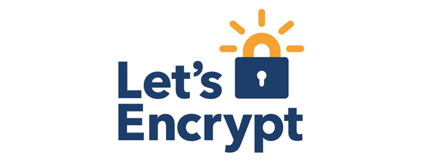
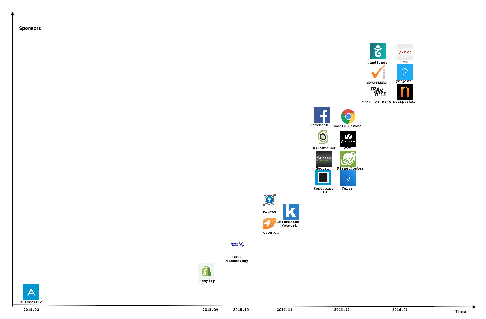
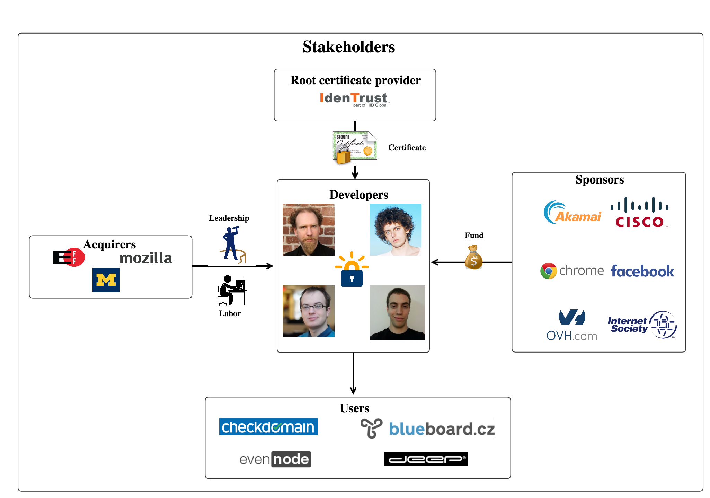
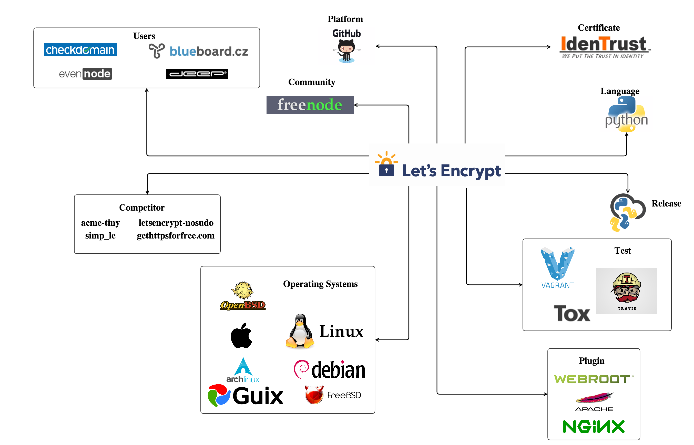
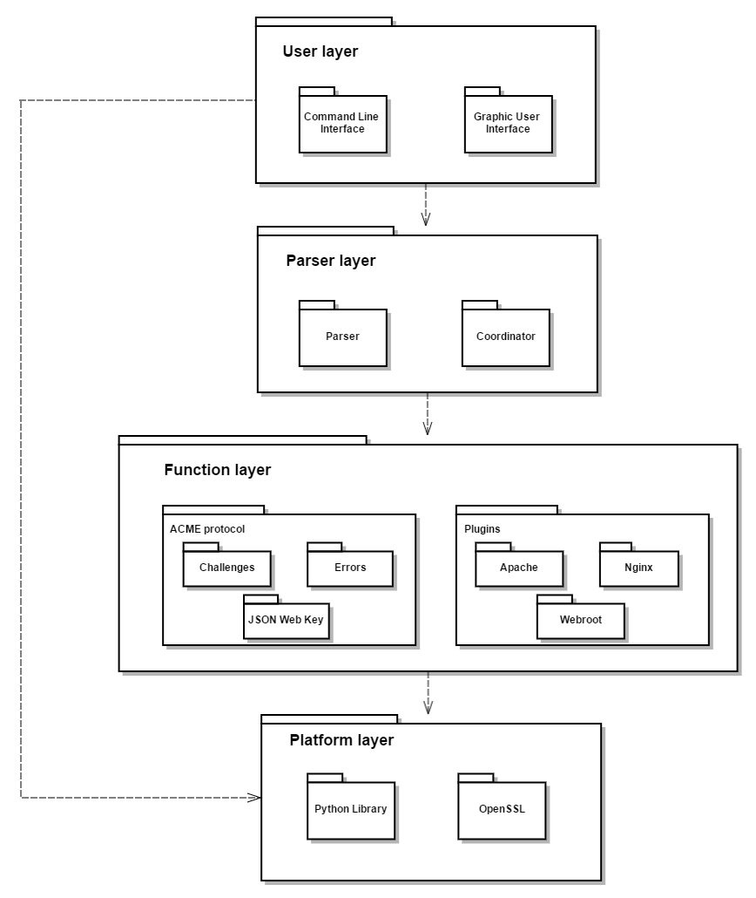
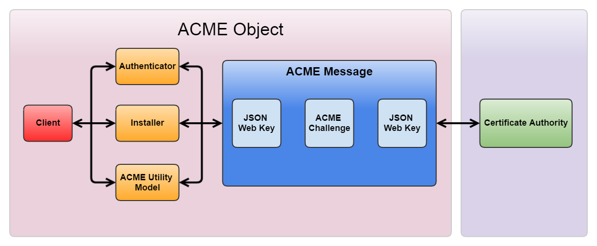
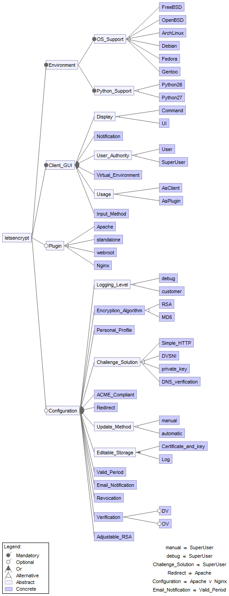

#Let's Encrypt

By Yu Wang, Xilin Li, Wang Jing, and Changliang Luo
from
*Delft University of Technology*

##Abstract

Let’s encrypt is a software aiming to automatically request Digital Certificates and install/renew the certificates on web servers. As a highly active project launched in less than four months, it is interesting to see how it progresses to improve the efficiency of development, maintenance and test. The report first introduces the necessary knowledge about Digital Certificate and ACME protocol on which the whole project is based. Then, a thorough analysis is done to gain a deep understanding of the software architecture of Let’s Encrypt. The analysis of its stakeholders and Context View shows how the project involves different groups of people and interacts with the external environment. Development View is about its architecture that supports the development process and Deployment View about the environment the system is deployed in. At last, Variability Perspectives and Evolution Perspectives show its flexibility to accomodate variability and changes.

##Contents

* [Abstract](#Abstract)
* [Introduction](#Introduction)
* [Views and Perspectives](#Views and Perspectives)
   * [Stakeholder Analysis](#1 Stakeholders Analysis)
   * [Context View](#2 Context View)
   * [Development View](#3 Development View)
   * [Deployment View](#4 Deployment View) 
   * [Variability Perspectives](#5 Variability Perspective)
   * [Evolution Perspectives](#6 Evolution Perspective)
* [Conclusion](#Conclusion)
* [References](#References)
* [Appendix](#Appendix)

#Introduction

Being perpetrated by malwares and viruses  these days, it is more critical than ever to keep the online communication secured. Unfortunately, modern cryptography techniques in many case are too expensive and difficult to implement. 
Fortunately,that has been changed with the appearance of [LetsEncrypt.org](https://letsEncrypt.org) ! The goal of Let’s Encrypt is to set up an HTTPS server and have it automatically obtain a browser-trusted certificate, without any human intervention. Before analyzing Let's Encrypt, it is necessary to have some background knowledge. 

####SSL/TLS

Transport Layer Security Protocol (TLS) and its predecessor -- Secure Socket Layer Protocol (SSL) are both referred to as “SSL”. These two protocols aim to provide encrypted communication between two parties. For SSL/TLS communications, the server side needs to provide a Digital Certificate (for convenience it is referred to SSL certificate for the rest of this report) to verify its identity (to prove that the server owns a set of domain names such as www.google.com, www.paypal.com).

####Digital Certificate

Digital Certificate is in fact a digital file which can prove the website is the owner of a certain domain name. The digital certificates are authorized by Certificate Authority and installed in web servers.

####Certificate Authority (CA)

CA is an online organization which issues the Digital Certificate. To automatically respond to the requests from Let's encrypt, a CA must install a software called “boulder” to cooperate with Let’s Encrypt. Boulder can automatically issue a digital certificate when it receive an certificate request from Let's Encrypt.

####ACME protocol

In many cases (e.g. online payment),the identities of Internet entities (client and server) need to be verified. However, today’s verification is done by some ad-hoc mechanisms which are not suitable for future development of online verification. Automatic Certificate Management Environment (ACME) protocol [[1](#acme)] aims to address such issue by standardizing and automating the procedures of verification. In other words, it is a “bag of procedures” by doing which a Certificate Authority issues a certificate to a client.

####Workfolw of Let's Encrypt

Let’s Encrypt is a software automating the tasks of obtaining certificates and configuring web servers to use them. It is based on ACME protocol and accomplished by running a certificate management agent on the web server. The workflow can be summarized as follows:

1. When a certificate is requested, Let’s Encrypt wraps the necessary information (the account, the domain name and etc) into standard format and sends it to boulder of a CA;
2. CA responds the request with a “challenge” which is a special task to verify the ownership of the server;
3. Let’s Encrypt automatically solves this challenge;
4. CA grants a certificate after the challenge has been solved.

In this report, the project is analyzed from different views and perspectives. In the first section, we identified 5 different types of stakeholders and studied how they are related to the project. Then, the Context View is presented to demonstrate the relationship between Let’s Encrypt and its external enviroment.

In the section of Development View, we aim to analyze the architecture of Let’s Encrypt that concerns the development process.

The section of Deployment View describes the enviroment (software/network enviroment) requirements of Let’s Encrypt. 

The section of Variability Perspective shows the variable features provided by Let’s Encrypt. To gain a deeper understanding, the implementation strategies and evolution history are analyzed.

In the section of Evolution Perspective, we made a list of several possible changes of Let’s Encrypt in the future and the corresponding architecture tactics used by Let’s Encrypt to increase its flexibility to accomodate such changes.

#Views and Perspectives

##1 Stakeholders Analysis
5 types of stakeholders are identified for Let's Encrypt as follows:

### Acquirers

We identified three organizations as the acquirers of Let's encrypt:

- [Electonic Frontier Foundation](https://www.eff.org/)

- [Mozilla Foundation](https://www.mozilla.org/en-US/)

- [University of Michigan](https://en.wikipedia.org/wiki/University_of_Michigan)

These three foundations aim to provide a free, automated and open certificate authority to users. They establish a public benefit corporation, Internet Security Research Group (ISRG), to serve the purpose. The members in this group are the main contributors of Let’s Encrypt.

### Developers

So far, 165 contributors have made contributions to the development of let’s encrypt. The core development team consisting of 11 people comes from a public benefit organization [Internet Security Research Group (ISRG)](https://letsencrypt.org/isrg/). The whole project is based on ACME protocal proposed by ISRG. Unsurprisingly, they made most of the contributions to this project. 

For a newly established project like Let’s Encrypt, these developers more or less have responsibilities for testing, maintaining and github management. For example, @[pde](https://github.com/pde) and @[bmw](https://github.com/bmw) are identified as integrators who ensure the quality of the project by communicating with contributors on github. They are also responsible for merging pull requests and interacting with contributors, no matter whether the pull requests are accepted or denied. We notice that the biggest challenge for Let’s Encrypt is maintaining the quality of the project when massive incoming contributions taking place everyday. To solve this, a complete strategy of testing and integration is proposed which will be discussed later.

Here we list several major developers:

- @[Liam Marshall](https://github.com/ArchimedesPi)

- @[bmw](https://github.com/bmw)

- @[Felix Rieseberg](https://github.com/felixrieseberg)

- @[Francois Marier](https://github.com/fmarier)

- @[pde](https://github.com/pde)

The other contributors are either users of let’s encrypt or github users who are interested in this project. Their contributions are mainly about improving command line, fixing bugs and format.  As a BETA software, Let's Encrypt has some bugs to fix.

### Users

The potential users of Let's encrypt are websites which want to obtain SSL/TLS certificate. Let’s encrypt automates the process of obtaining certificates and moreover, totally free of charge. As a result, the number of its potential users is huge. In fact, Let’s Encrypt has just issued its millionth certificate in March, 2016.

### Sponsors

Let's Encrypt is initialized by a non-profit organization (ISRG) to enable secure communication over the Internet for the purpose of overcoming financial, technological and education barriers. Corporate Sponsorship helps speed up the process resulting in a secure Web. The number of sponsors keeps increasing especially in the last four months. The dramatic rise in the number of sponsors reflects the success and importance of the programme.

### Additional Stakeholder

- [IdenTrust](https://www.identrust.com/) (Root certificate provider)

Let us first explain the concept of root certificate providers.
Certificate provider is a root certificate provider if and only if:

1. it can authorize other organizations to be the new certificate providers;

2. it doesn’t need any other organizations to authorize it to be a certificate provider.
For example, certificate provider A can authorize organization B to be a new certificate provider.
Later, B can authorize C to be a new certificate provider.
A in our case is the root certificate provider.
IdenTrust is a root certificate provider who authorizes Let’s Encrypt.

The graph of stakeholders is shown below:

##2 Context View

This section concerns about the relationships, dependencies and interactions between Let’s Encrypt and its environment[[2](#Nick)]. It gives readers an image about the responsibilities and boundaries of the system.

###2.1 System scope and Responsibilities

Let's Encrypt allows users to do following things:

- Create their own account
- Modify their personal profile
- Choose which ACME solution to use (optional)
- Turn on/off the notice of expiring date of certificate (optional)
- Register certificate for their server
- Revoke certificate

###2.2 Entities, data and interfaces

An overview of the relationship between Let’s Encrypt and its entities is shown in Figure 3.

As mentioned above, in order to become a Certificate Authority, Let's Encrypt must be authorized by the root certificate provider IdenTrust. The only language dependency of Let's encrypt is Python and the development is based on GitHub platform, where both ISRG members and individual GitHub users can contribute. Let's encrypt also takes advantage of online community such as Freenode to allow discussion of issues among developers and users. The releases of different versions will be first strictly tested by Tox (standardize testing) and Travis CI (online test system) and then, posted using the Python Package Index (PYPI). 

Let's Encrypt provides service to a large number of users. Here we only give two examples, [blueboard.cz](https://blueboard.cz/) and [checkdomain](https://www.checkdomain.de/ssl/zertifikat/ssl-free/). Users can operate Let's Encrypt on a series Unix-ish Operating Systems like Arch, Debian, FreeBSD, etc. In addition, Let's Encrypt extends its support for different servers such as Apache, Nginx and Webroot by using a plugging architecture. 

Finally, there exist other softwares based on ACME that compete with Let’s Encrypt like [acme-tiny](https://github.com/diafygi/acme-tiny) and [simp_le](https://github.com/kuba/simp_le).

##3 Development View

The development view describes the architecture that supports the software development process.
The development view communicates the aspects of the architecture of interest to stakeholders from the building, testing, maintaining and enhancing the project[[2](#Nick)].
The following article shows module structure model and the common design model of Let's Encrypt which give a technical overview of the whole project.
In addition, technical debt of the project and the corresponding solutions are described at the end of this section.

###3.1 Module Structure Model

The UML component diagram below gives an overview of the module structure. Each package is a code module and the arrow shows the intermodule dependencies[[2](#Nick)].

- **User layer**: the uppermost layer which is also the closest layer to users offers UI for clients to set up their own certificates, while command line is also available. 

- **Parser layer**: after receiving commands from the upper layer, the coordinator module checks the compatibility to ensure the job can be successfully done in a certain environment. Then, the commands are parsed by the parser and the function layer is called.

- **Function layer**: as the core layer of the whole project, function layer offers important functions to automate the tasks of obtaining a certificate. The ACME module provides a protocol that allows an applicant to obtain a certificate automatically from a Certificate Authority (CA). It includes a challenge module which automatically solves the challenge provided by CA. Moreover, JSON Web Key (JWK) module creates a cryptographic key in the data structure. Another module in this layer is Plugins, providing a plugin architecture to facilitate support for different web servers. Currently, web servers including Apache and Nginx are supported by Let’s Encrypt.

- **Platform layer**: in the bottom layer, it can be observed that the only language dependency is python. In addition, OpenSSL, a software library used to secure communications against eavesdropping or to ascertain the identity of the party at the other end, is the base of authentication process.

Since the software is based on ACME, it is necessary to gain a deeper understanding of how ACME module works. The graph below shows the details about the internal relations in ACME protocol. The communication between ACME Client and CA is via the ACME Message. ACME Message is an object specified by ACME protocol,  the definition of which is similar to the Packet in Transmission Control Protocol (TCP). 

To understand how it works, let’s walk through a typical process. When Let’s Encrypt client wants to communicate with CA, for example, requesting an account, it first wraps the JSON Web Key as payload into an ACME Message and then send it to CA. The payload of ACME Message can also be ACME Challenge or ACME Error. After having processed the message, CA sends back a Message to Let’s Encrypt.

Authenticator, Installer and ACME Utility Module are responsible for generating and wrapping other kinds of payload into an ACME message and send it to CA for parsing. Authenticator is used to deal with ACME Challenge, Installer deals with JSON Web Key and Digital Certificates. ACME Utility Module provides encryption/decryption and other utilities. It also deals with ACME errors.

###3.2 Common Design Model

####3.2.1 Common Processing

- **Instruction parsing**: 
Parsing instructions is considered to be a common process because: (1) many modules rely on user's instructions to determine the subsequent actions; (2) the parsers in different modules are similar to each other. Hence, the parsers can be put into a separate module. In fact, all codes relevant to the parsers reside in the file *letsencrypt-auto* and *cli.py*.

- **ACME objects processing**: 
To implement ACME Protocol, Let’s Encrypt contains ACME objects such as ACME account and ACME exceptions. Those objects are used almost everywhere in Let’s Encrypt. When a user wants to request an account, for example, an account object is created and returned. Such account will later be used when a certificate needs to be requested or renewed. Many modules of Let’s Encrypt need to process ACME objects to initiate, update, transmit or destroy a certificate. Therefore, for convenience, developers of Let’s Encrypt wrap all the functions used for processing ACME objects into a separate module.

- **Configuration processing**:
Configuration object is "a bag of attributes" used by almost all the modules. For instance, a user might want to register his/her information in such way "I have a domain name abc.com; my account is xxxxx; my private key stores in xxxxx; please give me a certificate for that domain name". Processing a configuration object containing these attributes enables Let’s Encrypt to automatically obtain, renew and revoke a certificate. Such processing is needed in almost all the modules. Therefore, the configuration object (as well as the relevant functions) is wrapped into a module.

####3.2.2 Build, Integration and Test Approach

To provide developers a convenient environment and also protect project source version, Let's Encrypt has an official workflow for building, integrating and testing. 

##### **Build**

Let's Encrypt supports multiple operating systems. Users can install the client according to their requirements. However, developers should have their own local copies based on their platform and run the client in developer mode from local tree for a technical test. 

##### **Integration**

To contribute to Let's Encrypt project, developers have to follow the strict integration process made by project team.

- Developers can firstly find open issues in the GitHub issue tracker or post new issues for their own idea.

- Then developers start to work on the problem, post a comment to let others know and seek feedback on the plan where appropriate.

- Once the developer gets a working branch, he/she can open a pull request. All changes in pull request must pass complete test. Generally it is sufficient to open a pull request and let Github and Travis run integration tests for you. However, if developers prefer to run tests, they can use Vagrant, using the Vagrantfile in Let’s Encrypt’s repository. 

- Let's Encrypt integrator will review the pull request and make a decision to merge or not.

##### **Test**

Before the pull requests are merged, they have to first go through a unit coverage test , pass the integration test, and comply with the coding style of Let's Encrypt. It can be performed on a popular online testing platform Travis CI. 

Another option for developers is to do their own test locally before pulling a request. Tox is officially recommended as a testing tool for running a full set of tests including config file parsing test and codes style testing. For debugging purpose, ipdb is a package used for detecting syntax errors.

###3.3 Technical Debt

The concept of technical debt refers to the accumulated consequences of the quick but dirty design into an evolving software program [[3](#Fowler)]. In other words, the danger occurs when people rush software by simply adding features into the program but never reflect their understanding of those features. As the “debt” accumulates, the complexity of maintaining the programs to reduce its deterioration to the entire software increases [[4](#Cunningham)].

####3.3.1 Code Duplication

In issue [#383](https://github.com/letsencrypt/letsencrypt/issues/383), code duplication exists between apache and nginx plugins; and in issue [#698](https://github.com/letsencrypt/letsencrypt/issues/698), [Dockerfile-dev](https://github.com/letsencrypt/letsencrypt/blob/26c1f003d0d05397154fe63e1f452ed2148cfe75/Dockerfile-dev) and [Dockerfile](https://github.com/letsencrypt/letsencrypt/blob/26c1f003d0d05397154fe63e1f452ed2148cfe75/Dockerfile) also duplicated. 
Problem arises when codes are just copied and changed slightly, making it difficult to maintain the software project.

Duplicated code, also known as “copy-and-paste development”, is produced by copying existing code and then using it somewhere else. This strategy of producing code is frequently employed as a way of reusing software. However, code duplication can be very negative in the long term. First of all, code duplication causes an increase in code size. Secondly, duplication increases the difficulty of maintaining. Moreover, code duplication can also be a sign of poor design, indicating that the generic functionality has not been properly abstracted. Consequently, code duplication needs to be carefully avoided in the long term, especially during the maintenance phase.

####3.3.2 Documentation

For an open source project, it is vital to have a good documentation system so that developers in such communities can understand, reuse and develop the code in a more efficient way. The documentation of Let's Encrypt still needs improvement. We notice that 59 issues are labeled `documentation` on GitHub. These issues indicate that the documentation is not well-structured, lacking architecture description and module information, which make it difficult to understand how the project works and how the module connects to each other. In addition, insufficient documentation also confuses users.

For example in issue [#2271](https://github.com/letsencrypt/letsencrypt/issues/2271), the developers discuss the text related to certificate renewal. The former version of documentation is “to renew a certificate, simply run Let's Encrypt again providing the same values when prompted. In almost all circumstances, renewal should be performed with the certonly subcommand”. It seems that the second sentence contradicts the first. Moreover, it is not as detailed as it should be.

####3.3.3 How developers deal with technical debt
Developers usually find out technical debt through Issues, discuss it and figure out a solution. To resolve technical debt and  relevant issues mentioned above, Let’s Encrypt uses the following methods:

- Code Duplication: Recent advances in static code analysis and hardware performance enable tool-based localization of code duplication in industrial contexts. For developers, they could use such tools to detect and resolve duplicates by sharing common util functions (as they did in [#382](https://github.com/letsencrypt/letsencrypt/pull/382)).

- Documentation: There are insufficiencies in the documentation that the developers are not aware of. However, they are willing to fix it when users post issues on GitHub (as what they did in issue [#2216] (https://github.com/letsencrypt/letsencrypt/issues/2216) and [#2271](https://github.com/letsencrypt/letsencrypt/issues/2271)).

##4 Deployment View

Considering the wide use of Let’s Encrypt, it is important to clarify the deployment of the software to guarantee proper operation in different environments. 
Deployment describes the environment into which a system will be deployed and the dependencies that the system has on elements of it[[2](#Nick)]. 
In this section, we point out a number of constraints on Let’s Encrypt including third party software requirements, technology compatibility and network requirements.

###4.1 Software Requirements and Technology Compatibility

Identifying third party software requirements and technology compatibility is essential for both developers and users. For developers, they can clearly know what tools or libraries are available for further use. Users can know what is exactly needed to apply such software on their environments. 

For Let’s  Encrypt, following softwares are required to be installed on user machine:

- **Python**: Python programming language. And it is required to use Python 2.6 or 2.7, while Python 3.x support is currently not available. When installing Let’s Encrypt, it will automatically check the version of Python in user environment and install it if there is no proper library.

- **OpenSSL**: a software library implementing the Secure Sockets Layer (SSL) and Transport Layer Security (TLS) protocols.

- **ACME**: Automatic Certificate Management Environment (ACME) protocol implementation in Python.

- **ConfigArgParse**: Python command-line parsing library. It is required that the version of ConfigArgParse must higher than 0.9.3.

- **cryptography**: a package which provides cryptographic recipes and primitives to Python developers.At least version 0.7 should be used.

###4.2 Network Requirements

Let’s Encrypt runs a certificate management agent on the web server. The node in the system can be divided into two categories: Server and Client. On its client side, it requires port 80 or 443 to be available. On its server side, Let’s Encrypt has rate limits for certificate issuance. These limits are in place primarily to protect services from both accidental and intentional abuse. Let’s Encrypt has the following rate limits in place:

- **Names/Certificate**:  is the limit on how many domain names users can include in a single certificate. This is currently limited to 100 names, or websites, per certificate issued.

- **Certificates/Domain**:  user could run into through repeated re-issuance. This limitation measures certificates issued for a given combination of Public Suffix + Domain (a "registered domain"). This is limited to 5 certificates per domain per week.

- **Registrations/IP address**: limits the number of registrations users can make in a given time period; currently 500 per 3 hours. This limit should only affect the largest users of Let's Encrypt.

- **Pending Authorizations/Account**: limits how many times an ACME client can request a domain name be authorized without actually fulfilling on the request itself. This is most commonly encountered when developing ACME clients, and this limit is set to 300 per account per week.

There is no limit of the number of certificates that can be issued to different domains.

##5 Variability Perspective

Variability describes the ability to derive different products from a common set of artifacts[[6](#Sven)]. It is important for a good software to equip with variability to adapt to different environments, which also largely satisfies the requirements of different stakeholders. In spite of a BETA software, Let’s Encrypt provides plenty of variable features. In this section, a list of features and dependencies are given and then, a related model is built upon this. The strategies to implement such variabilities are also discussed.

As mentioned above, Let’s Encrypt is a BETA software still in its earlier version. It can be seen from the GitHub milestone that a great amount of work focuses on improving its flexibility to equip with variability. That is why it is interesting to address its evolution history here to see how Let’s Encrypt deals with changes in the system development lifecycle.

###5.1 Variable Features

A feature is a characteristic or end-user-visible behavior of a software system[[6](#Sven)]. We identified a list of variable features and classified them into four categories. We identified a list of variable features and classified them into four categories. Moreover, features in Let's Encrypt come with different binding times. Most features are at run time, others at compile time[[7](#Lee)]. Main features are as follows:

- Virtual Environment: Let’s Encrypt allows users to decide whether to use virtualenv (virtual environment package) or not.

- Usage (as plugin or client): Let’s encrypt can not only serve as an independent application, but also as a third party plugin in other software.

- Notification of configuration change: User can switch on/off notification of configuration change. For example, if someone changes the storage path of a file, there should be notification of the change by default. However, user can decide to enable/disable such notification.

- Web server support: Let’s Encrypt client supports a number of different “plugins” that can be used to obtain and/or install certificates. Plugins which can obtain a specific certificate are called “authenticators” and can be used with the “certonly” command. Plugins that can be used to install a certificate are called “installers”. Apache, Nginx and webroot are plugins currently supported. Moreover, users can use a “standalone” web server to obtain a certificate. This is useful on systems with no web server, or when direct integration with the local web server is not supported or not desired.

- Allow specifying encryption algorithm: ACME protocol enables multiple types of encryption algorithms like RSA and MD5. Let’s encrypt enables all these algorithms.

- Editable certificate and key storage path: The path of storing a certificate is specified by default after installing Let’s Encrypt. However, users are allowed to edit the storage path.

- Multiple Challenge solution: There are many ways of solving challenges to prove someone owns a certain domain name: Simple HTTP, Domain Validation with Server Name Indication(DVSNI) and DNS verification. If it is not chosen manually by users, Let’s Encrypt will pick the default one.

- Optional ACME compliant services: Let’s Encrypt supports a number of CAs and allows users to choose their favorite one by command line.

- Optional redirect (optionally install an http -> https redirect). After obtaining an SSL certificate, browser turns from http to https. User can choose whether to use a hybrid strategy (http and https are both valid) or only validate https.

- Verification: Let’s Encrypt currently supports two types of verification, Domain-Validated (DV) and Organization-Validated (OV) Certificate. Users can choose between these two verifications.

- Revocation: Let’s Encrypt allows users to revoke a certificate after losing the ownership of the server. 

- Adjustable key bit-length: The key bit-length is adjustable and its default value is 2048.

- UI/Command switch: Let’s Encrypt supports ncurses(a programming library providing an API that allows the user to write text-based user interfaces) [[8](https://github.com/delftswa2016/team-letsencrypt/blob/Improvement/draftv1.md#ncurses)] UI, or can be driven entirely from the command line. Users can choose between UI and command line.

###5.2 Implementation Strategy

The key to implement variability and configurability is using interface. All the interfaces need to be implemented are stored in the file `interface.py`. In the [developer guide](https://letsencrypt.readthedocs.org/en/latest/contributing.html) announce that what interface should be implemented by a specific kind of class. The interface.py and the developer guide together draw an outline for the let’s encrypt: what configuration can be done, what parameter can be specified, what Operation System it should support, what plugin it should support. Hence the variability and configurability have been implemented.

###5.3 Evolution History of Variability and Configurability

Let’s Encrypt has already included the most important features in its first release. More features are added in the following releases. The contributions focus mainly on the support for Operation Systems, different versions of python, improvements of configuration file and command line flags, support for new plugins, and implementations of more ACME challenge solutions. 

Release note is a good method to figure out the evolution history. To see the changes of the given releases in Let’s Encrypt , we inspect the GitHub milestone for the following releases:

- [0.1.1](https://github.com/letsencrypt/letsencrypt/issues?q=milestone%3A0.1.1)- This version includes important bugfixes over the Public Beta / 0.1.0 version:
1) fixed a confusing UI path that caused some users to repeatedly renew their certs; 2) completed numerous Apache configuration parser fixes; 3) fixed `--webroot` permission handling for non-root users.

- [0.2.0](https://github.com/letsencrypt/letsencrypt/issues?q=is%3Aissue+milestone%3A0.2.0)- This version added Apache plugin support for non-Debian based systems and PyOpenSSL support for versions 0.13 or 0.14. In addition, it supports HTTP to HTTPS
redirect on some systems.

- [0.3.0](https://github.com/letsencrypt/letsencrypt/issues?q=is%3Aissue+milestone%3A0.3.0)- This version enabled a non-interactive mode by including `-n` or `--non-interactive` on the command line to guarantee the client will not prompt when running automatically.

- [0.4.0](https://github.com/letsencrypt/letsencrypt/issues?q=milestone%3A0.4.0)- In this version, two major changes were made to support the variability and configurability: 1) a new subcommand renewal can be used to renew the existing certificates as they approach expiration; 2)  full support for Python 2.6 is enabled.

- [0.4.2](https://github.com/letsencrypt/letsencrypt/issues?q=is%3Aissue+milestone%3A0.4.2)- A patch fixing problems of using Let's Encrypt `renew` with configuration files from private beta has been added.

Issues and pull requests relevant to the variability and configurability can be classified as follows:

- **Improvement of Operation Systems support**: the first release version only supported Ubuntu with version before 14.04. The supports for Debian, Mac, CentOS and later version Ubuntu are enabled in the following versions. Relevant issues include [# 292](https://github.com/letsencrypt/letsencrypt/pull/292), [508](https://github.com/letsencrypt/letsencrypt/pull/508), [840](https://github.com/letsencrypt/letsencrypt/pull/840), [1206](https://github.com/letsencrypt/letsencrypt/pull/1206), [1232](https://github.com/letsencrypt/letsencrypt/pull/1232). 

- **Support for different versions of Python**: at the beginning, Let’s encrypt only supported python 2.6. The support for later versions of python, especially python 3.x, is enabled now. Relevant issues include [# 605](https://github.com/letsencrypt/letsencrypt/pull/605), [957](https://github.com/letsencrypt/letsencrypt/pull/957), [1508](https://github.com/letsencrypt/letsencrypt/pull/1508).

- **Improvement of configuration**: numerous configuration options are added and the command lines becomes more user-friendly. For example, users can now specify the parameters such as the length of the RSA key. Relevant issues include [# 82](https://github.com/letsencrypt/letsencrypt/pull/82), [368](https://github.com/letsencrypt/letsencrypt/pull/368), [404](https://github.com/letsencrypt/letsencrypt/pull/404).

- **Support for different webserver plugins**: while the early version of Let’s encrypt only supported apache and nginx, now the supports for nginx, webroots, standalone are enabled. Relevant issues are [# 232](https://github.com/letsencrypt/letsencrypt/pull/232), [387](https://github.com/letsencrypt/letsencrypt/pull/387), [895](https://github.com/letsencrypt/letsencrypt/pull/895), [1395](https://github.com/letsencrypt/letsencrypt/pull/1395).

- **Implementations of more ACME challenge solutions**: ACME protocols allow different kinds of challenge solutions, but Let’s encrypt only implemented a small fraction of them. However, in the recent releases more challenge solutions are added by contributors. Relevant issues are [# 232](https://github.com/letsencrypt/letsencrypt/pull/232), [291](https://github.com/letsencrypt/letsencrypt/pull/291), [387](https://github.com/letsencrypt/letsencrypt/pull/387).

##6 Evolution Perspective

As the business maxim tells us “the only constant  is change”[[2](#Nick)], a major concern for architects is how to build a flexible system to adapt to inevitable changes. 
As a result, there is constant pressure to change the system’s behavior, which in many cases requires architectural tactics to ease such process. The term evolution is used as the process of dealing with changes encountered during the development lifecycle.

###6.1 Requirements Capture

To identify the evolution needs, the system requirements need to be re-analyzed to find out which of them will likely need to change over time.

####6.1 Identify Requirements

Based on the roadmap inferred from the existing documentation and discussion on forum and GitHub, the key evolution requirements in the future can be summarized  as follows:

|  Dimensions of Change | Magnitude of change required| Likelihood of change  |Timescale of change required|
|:-------------:|:-------------:|:-------------:|:-------------:|
| Less rate limits on the number of certificates issued per domain(**Growth**). | large-scale, high-risk|80%|approximately 7~10 months |
| Full support for web server like Nginx(**Functional**).     |  medium-scale, low-risk      |100% |approximately 3~4 months|
|Full IPv6 Support(**Functional**).| medium-scale, low-risk      |100% |approximately 2 months|
|Certificate Compatibility with Windows XP(**Platform**).|small-scale(defect correction), low-risk|100%|approximately 2~3 months|
|Elliptic Curve Cryptography (ECC) Support(**Functional**).|medium-scale, high-risk|60%|approximately 8~10 months |

####6.2 Evolution Tradeoff

The tradeoff depends on the type of the system, the likelihood  of the change and the confidence to defer the change until it is required. It means the prioritized evolution requirements will take flexibility into account at the beginning while others defer the efforts. 

Architects of Letsencypt consider support for IPv6 and Nginx at initial development since they are the necessary features the project wants to include. By creating extensible interfaces for IPv6 and Nginx, the system becomes flexible for later change.

The issues of lessening rate limits on the number of certificates issued per domain and certificate compatibility with Windows XP are also considered even not with the highest priority. The reason is that the compatibility problem is a small-scale issue in our case while the rate limit demands more on the hardware support than software architecture. 

ECC support is deferred until it is required for a reason that this feature is not needed recently and possibly will not happen in the future. Thus, it is not worth investing efforts in it at the very beginning.  

##Conclusion

In this report, we studied the stakeholders, views and perspectives of an open source project Let’s Encrypt. Throughout the analysis of its software architecture we draw the following conclusions: 

The analysis of stakeholders and context view of Let’s Encrypt shows us the roadmap of the project and how it proceeds to fulfill its roadmap. By first having a whole picture of the project, we then look into it and gain a deeper understanding from different perspectives and views. 

In the section of development view, the architecture of Let’s Encrypt that serves the development process is analyzed. Its design principles show an example of how a well-structured project facilitates the development, maintenance and test process.

We also gain knowledge from the analysis of deployment view on how to guarantee the proper operation in different environments, which is quite useful for both users and developers.

At last, the variability perspective and evolution perspective focus on the design that enables a project to equip with variability and changes. It shows us the importance for an architect to be prepared for variability and changes during the development lifecycle.

To conclude, a well-structured architecture of a software satisfies its related stakeholders and makes the development, maintenance  and test process easier. Let’s Encrypt is a BETA SOFTWARE containing plenty of bugs, which makes the analysis challenging but interesting. To get involved into the project, we made contributions by pulling request on GitHub and two of them got merged. Our main contributions are listed in the appendix.

##References
1. 
R. Barnes, J. Hoffman-Andrews, J. Kasten. Automatic Certificate Management Environment (ACME). https://letsencrypt.github.io/acme-spec/ . 2015

2. 
Nick Rozanski and Eoin Woods. Software Systems Architecture: Working with Stakeholders using Viewpoints and Perspectives. Addison-Wesley, 2012.

3. 
Fowler Martin. TechnicalDebtQuadrant. http://martinfowler.com/bliki/TechnicalDebt.html. 2014.

4. 
Cunningham Ward. Ward Explains Debt Metaphor. http://c2.com/cgi/wiki?WardExplainsDebtMetaphor. 2011.

5. 
Let's Encrypt Project. Let’s Encrypt client documentation! https://letsencrypt.readthedocs.org/en/latest/index.html.

6. 
Sven Apel, Don Batory, Christian Kästner, Gunter Saake.Feature-Oriented Software Product Lines. 2013.

7. 
Lee, Jihyun, & Hwang Sunmyung. A review on variability mechanisms for product lines. International Journal of Advanced Media and Communication, 5(2-3), 172-181. 2014

8. 
Wikipedia,ncurses.https://en.wikipedia.org/wiki/Ncurses . 2016

##Appendix - Contributions
1. Pull request: [#2612](https://github.com/letsencrypt/letsencrypt/pull/2612)

    Time: March 5th

    Content: It is a display error in Let's Encrypt document at website ["Read the Docs"](http://letsencrypt.readthedocs.org/en/latest/using.html?highlight=mail#webroot). This is a command line exceeding the border of the browser window. We make a horizontal scroll to display a long text (both in rst and html) and test it with Chrome, Firefox and Safari at Mac OSX and Ubuntu.

2. Pull requests: [#2657](https://github.com/letsencrypt/letsencrypt/pull/2657), [#2658](https://github.com/letsencrypt/letsencrypt/pull/2658), [#2659](https://github.com/letsencrypt/letsencrypt/pull/2659), [#2659](https://github.com/letsencrypt/letsencrypt/pull/2659)

    Time: March 12th - March 14th
    
    Content: The documentation of Let's Encrypt is not so friendly to new comers. Since Let's Encrypt is a implementation of ACME, we propose to add a link to ACME specification. The handle of the request takes some time because the link is not up to date and we fix it.

